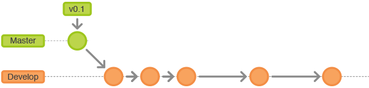

# Branch Management
There are many branch management flows that can be implemented. Some flows might work fine with some projects but can be ineffective with others because of their nature. That’s the reason why there isn't a golden rule to follow when you are creating a branch management flow.
In this section we will describe our recommendations, which we have been using in many projects and worked really well.

We can distinct between two types of branches: the **main branches** and the **supporting branches**. The main branches are branches that should never be deleted, these branches represent every stage of the code. The supporting branches always have a limited life time, these branches are created to develop a feature, fixing a bug, etc.

**Important:** Main branches should be protected branches and should require pull request reviews before merging.

###Main branches

`develop` Contains all the latest features developed by the team. This is an unstable branch, basically, it is constantly receiving features from the developers.

`master` Holds the production code, or App/Play Store versions. This is our production branch and it must be stable.

`qa_testing` This branch is where the QA team do their tests. It contains all the features that will be released to the client or beta testers.

`stage` Holds the latest released version to the client or beta testers. This is a stable branch.

The last 2 (`qa_testing` and `stage`) are perfect examples of branches that may not fit in your project as well. Feel free to just use `develop` and `master`.

###Supporting Branches

`feature` Every time a developer starts a feature, a new branch out from develop must be created. Once the developer finishes the feature and ends testing it, the feature is ready to be merged into develop. Depending on the project, we encourage creating a pull request, that is reviewed by other devs, and then merged to `develop`.
These branches should be named as:
feature/[taskid]_taskname

`bug` Every time the QA team reports a bug, or the developer team detects one, that bug must be fixed on a bug branch. These branches should branch out from the qa_testing branch if it exists.
These branches should be named as:
bug/[taskid]_taskname

`hotfix` Every time a bug is discovered in stage or in production we should create a hotfix branch to fix this issue. Branching out from stage or master depending on where the bug was detected.
These branches should be named as:
hotfix/[taskid]_taskname
Merges

`epic` Basically this is a feature branch that contains an epic feature. Epic features are big features that can group many small features. Consider including an on/off mechanism inside the code (like a feature toggle). The behaiviour is exactly the same as the feature branch and should be named as:
epic/[taskid]_taskname

Epic branches may not be useful in your project. Also, for all branch names, you may choose to use `-` instead of `_`, there is no convention around this.

#Merging vs Rebasing

Merging vs rebasing is a really interesting discussion that we won't cover in the KB. We suggest <a href="https://www.atlassian.com/git/tutorials/merging-vs-rebasing">this article</a> as the starting point, and we consider it a **must read** for everybody.

##Merging Branches

Merging is Git's way of putting a forked history back together again. The `git merge` command lets you take the independent lines of develop created by `git branch` and integrate them into a single branch.
Understand all about it <a href="https://www.atlassian.com/git/tutorials/git-merge">here</a>.

###Main Branches Merges

`develop -> qa_testing` Once the features that will be added to the build are completed and merged into develop, we can merge with qa_testing so then the QA team can test the build.

`qa_testing -> stage` Once the QA team review the build and all the bugs found were resolved, we can merge qa_testing to stage.

`stage -> master` Once the Beta testers and the client give us the OK to go live, we are ready to upload the app to the App Store and this will require to merge stage with master.

`master -> stage` Every hotfix on master must be merged in stage.

`stage  -> qa_testing` Every hotfix on stage or any aditional code on stage must be merged into qa_testing.

`qa_testing -> develop` Every bugfix on qa_testing or any aditional code on qa_testing must be merged to develop.

###Supporting Branches Merges

`Feature -> develop` Once a developer completes a task and finishes testing that feature, that feature must be merged into develop.

`Epic -> develop` Once a developer completes an epic feature and finishes testing it, that feature must be merged into develop.

`Bug -> qa_testing` Once a developer fixes a bug detected on qa_testing, that fix must be merged into qa_testing.

`Hotfix -> Stable branch (stage or master)` Once a developer fixes a bug detected on a stable branch, it must be merged to that stable branch.

##Rebasing Branches

Merging is Git's way of putting a forked history back together again. The `git merge` command lets you take the independent lines of develop created by `git branch` and integrate them into a single branch.
Understand all about it [here](https://www.atlassian.com/git/tutorials/git-merge).

###Developing a feature

So you want to create a new feature, let's call it `add-user-auth`. Your remote repo has `master` and `develop` branches, and it looks something like this:

So you will `git checkout develop`, and `git checkout -b add-user-auth`. This will create a branch out of the tip of `develop`. Let's say your feature takes a couple of days of develop. In the meantime, someone introduced changes to `develop`, and now you have to fix some conflicts before being able to integrate commits on `add-user-auth`. Once you've updated code in `develop` branch, you need to `git checkout add-user-auth` and `git rebase develop`. This will apply your commits one by one on top of `develop` branch, thus changing `add-user-auth` base. Now your changes are ready to integrate into `develop` and merge would be just a fast-forward. Keep in mind you will have to solve conflicts in the process, and maybe solve conflicts on each of your commits. That's why many people squash their commits before doing this. We recommend reading [this article](https://robots.thoughtbot.com/git-interactive-rebase-squash-amend-rewriting-history#squash-commits-together) and [git's own documentation](https://git-scm.com/book/en/v2/Git-Tools-Rewriting-History) about it.

##Conclusion
"And that’s all you really need to know to start rebasing your branches. If you would prefer a clean, linear history free of unnecessary merge commits, you should reach for `git rebase` instead of `git merge` when integrating changes from another branch.

On the other hand, if you want to preserve the complete history of your project and avoid the risk of re-writing public commits, you can stick with `git merge`. Either option is perfectly valid, but at least now you have the option of leveraging the benefits of `git rebase`."[ref](https://www.atlassian.com/git/tutorials/merging-vs-rebasing#summary)